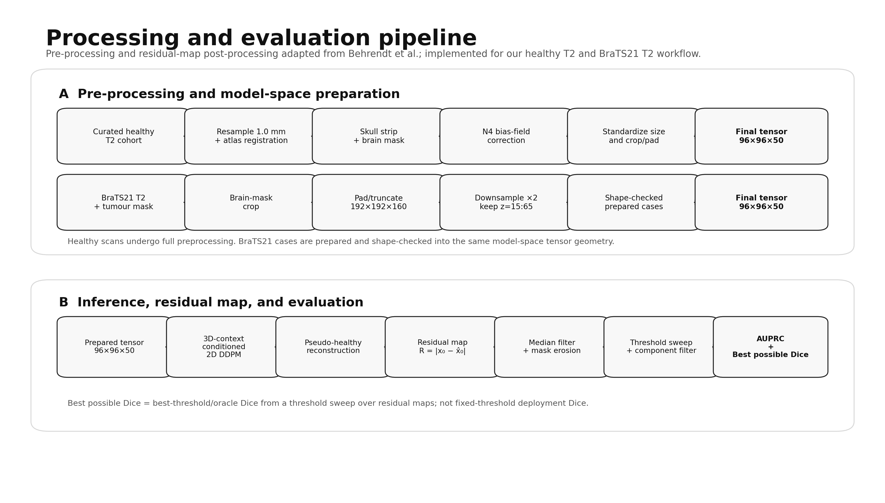
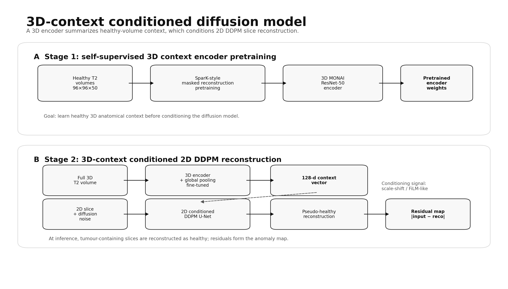
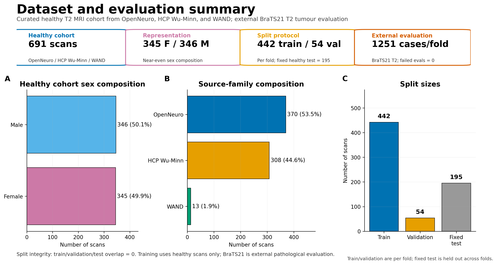
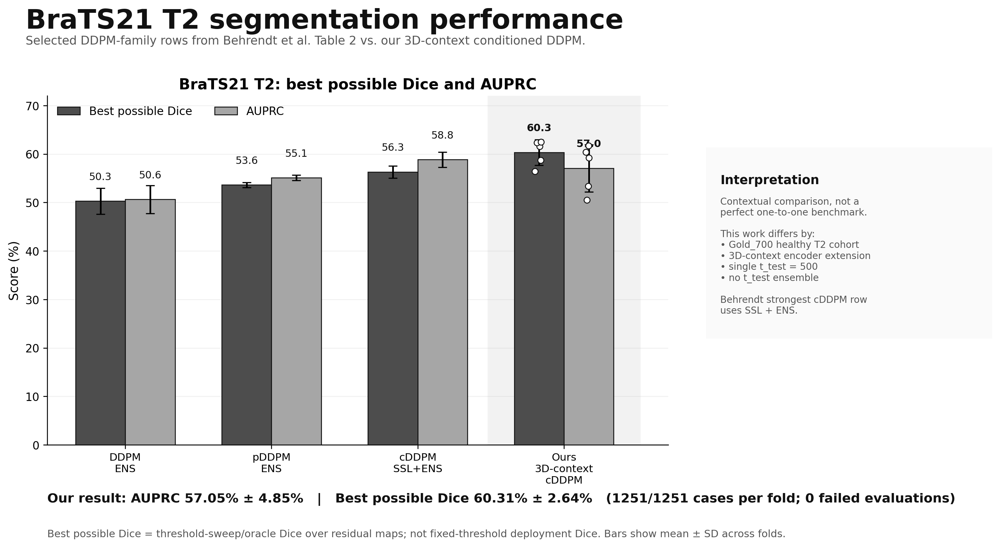

# 3D-Context Conditioned DDPM for T2 Brain MRI Anomaly Detection

This repository contains a 3D-context extension/adaptation of a conditioned diffusion model framework for unsupervised anomaly detection in brain MRI.

The model uses a **3D MONAI ResNet-50 encoder with SparK-style masked reconstruction pretraining** to extract volumetric context from a full T2 volume and conditions a **2D DDPM reconstruction model**. Anomaly maps are generated from reconstruction residuals and evaluated on BraTS21 T2 tumour scans.

## Project Summary

- Healthy training cohort: Gold_700 T2 MRI
- Final healthy cohort size: 691 scans
- Main protocol: Behrendt et al.-adapted repeated train/validation folds with a fixed held-out healthy test set
- Fixed healthy test set: 195 Gold_700 scans
- Per-fold development split: 442 train / 54 validation scans
- External pathological evaluation: BraTS21 T2 tumour scans
- Prepared BraTS21 cases: 1251
- BraTS21 preprocessing QA: 0 errors over 1251 prepared cases
- Model: 3D MONAI ResNet-50 encoder with SparK-style masked reconstruction pretraining + 2D conditioned DDPM
- Current completed Behrendt et al.-adapted folds: 5/5

## Method Overview

1. Curate healthy Gold_700 T2 volumes and standardize to the model space.
2. Create Behrendt et al.-adapted splits: fixed held-out healthy test set plus five train/validation fold CSVs.
3. Pretrain a 3D MONAI ResNet-50 encoder with SparK-style masked reconstruction pretraining on each fold's healthy training set.
4. Fine-tune a 2D conditioned DDPM using the pretrained 3D encoder context.
5. Evaluate each fold's model on the fixed external BraTS21 T2 set.
6. Report AUPRC and oracle best Dice using Behrendt et al.-adapted post-processing.

## Data Splits

Behrendt et al.-adapted split files:

- `Data/splits/finn_style/Gold700_Behrendt-et-al-adapted_train_fold0.csv`
- `Data/splits/finn_style/Gold700_Behrendt-et-al-adapted_val_fold0.csv`
- ...
- `Data/splits/finn_style/Gold700_Behrendt-et-al-adapted_train_fold4.csv`
- `Data/splits/finn_style/Gold700_Behrendt-et-al-adapted_val_fold4.csv`
- `Data/splits/finn_style/Gold700_Behrendt-et-al-adapted_test.csv`

Important: the fixed healthy test set is not used for model training or validation.

## BraTS21 Evaluation

BraTS21 is used only as an external pathological evaluation set. It is not mixed into Gold_700 training or validation.

Prepared BraTS21 model-space outputs:

- T2 image: `96×96×50`
- Binary tumour segmentation: `seg > 0`
- Binary brain mask

Evaluation uses:

- residual anomaly map: `|input - reconstruction|`
- fixed test timestep: `t_test = 500`
- Behrendt et al.-adapted post-processing:
  - median filtering
  - brain-mask erosion
  - small connected-component filtering
- metrics:
  - AUPRC
  - oracle best Dice over threshold sweep

Dice is **oracle best Dice**, not fixed-threshold deployment Dice.

## Current Results

Current completed folds: **5/5**

| Fold | Status | BraTS cases ok | Mean AUPRC | Mean oracle Dice |
|---:|---|---:|---:|---:|
| 0 | complete | 1251/1251 | 60.42% | 61.59% |
| 1 | complete | 1251/1251 | 59.21% | 62.34% |
| 2 | complete | 1251/1251 | 53.37% | 58.72% |
| 3 | complete | 1251/1251 | 61.71% | 62.47% |
| 4 | complete | 1251/1251 | 50.52% | 56.44% |

Current aggregate over completed folds:

- Mean AUPRC: **57.05% ± 4.85%**
- Mean oracle Dice: **60.31% ± 2.64%**

These are the final 5-fold Behrendt et al.-adapted evaluation results for the current submitted model. Dice is oracle best Dice over a threshold sweep, not fixed-threshold deployment Dice.

## Overview figures

### Processing and evaluation pipeline

### Model architecture

### Dataset summary

### BraTS21 T2 performance comparison

**Interpretation note:** The performance comparison is contextual, not a perfectly matched benchmark. Our model uses a 3D-context encoder extension and single `t_test = 500`; Behrendt et al.'s strongest cDDPM row uses SSL + ENS. Best possible Dice is threshold-sweep/oracle Dice, not fixed-threshold deployment Dice.

## Key Scripts

Split creation:

- `scripts/finn_style_cv/01_make_gold700_finn_style_splits.py`

Fold training/evaluation runner:

- `scripts/finn_style_cv/run_finn_style_one_fold.sh`

Result aggregation:

- `scripts/finn_style_cv/02_aggregate_finn_style_results.py`

BraTS evaluation:

- `scripts/brats_eval/08_eval_brats_ddpm3denc_Behrendt-et-al-adapted.py`

Reporting assets:

- `scripts/reporting/make_current_report_assets.py`

## Key Configs

- `configs/datamodule/Gold_700_finn_fold0.yaml`
- `configs/datamodule/Gold_700_finn_fold1.yaml`
- `configs/datamodule/Gold_700_finn_fold2.yaml`
- `configs/datamodule/Gold_700_finn_fold3.yaml`
- `configs/datamodule/Gold_700_finn_fold4.yaml`
- `configs/model/Spark_3D.yaml`
- `configs/model/DDPM_2D_3DEnc.yaml`

## Presentation Assets

Generated assets are stored in:

- `docs/presentation_assets/`
- `docs/tables/`

Useful figures include:

- `docs/presentation_assets/current_fold_performance.png`
- `docs/presentation_assets/gold700_finn_style_split_sizes.png`
- `docs/presentation_assets/gold700_source_composition.png`
- `docs/presentation_assets/gold700_sex_composition.png`
- `docs/presentation_assets/brats21_tumour_voxel_distribution.png`

## Reproducibility and Audit

Audit reports and run notes are stored under:

- `audit_reports/`
- `docs/run_notes/`
- `docs/code_snapshots/`
- `docs/reproducibility/`

## Limitations

- This is a 3D-encoder extension/adaptation, not an exact reproduction of the original cDDPM implementation.
- Gold_700 replaces IXI as the healthy training cohort.
- BraTS21 preprocessing was matched to the Gold_700/model-space pipeline and is not guaranteed to be identical to Finn et al.'s preprocessing.
- Dice is oracle best Dice over threshold sweep.
- Final claims should use the completed fold aggregate, not a single fold.
- The current README may be regenerated as new folds finish.

Additional note: This project focuses on BraTS21 tumour anomaly segmentation using AUPRC and oracle/best-threshold Dice. Healthy reconstruction-quality metrics such as SSIM, PSNR, and LPIPS, which are reported by Behrendt et al. for reconstruction analysis, were not included in the final reported results and are left for future extension.
